# Scenario Overview

The emulation of Mustang Panda included two smaller-scale scenarios targeting Windows-based systems. These scenarios focused on the adversary’s use of social engineering to deliver complex malware such as PlugX and TONESHELL. The emulation also prioritized Mustang Panda’s abuse of trusted Windows processes, including DLL side-loading for malware delivery, use of legitimate binaries for defense evasion and persistence, and reliance on native utilities for data collection and exfiltration.
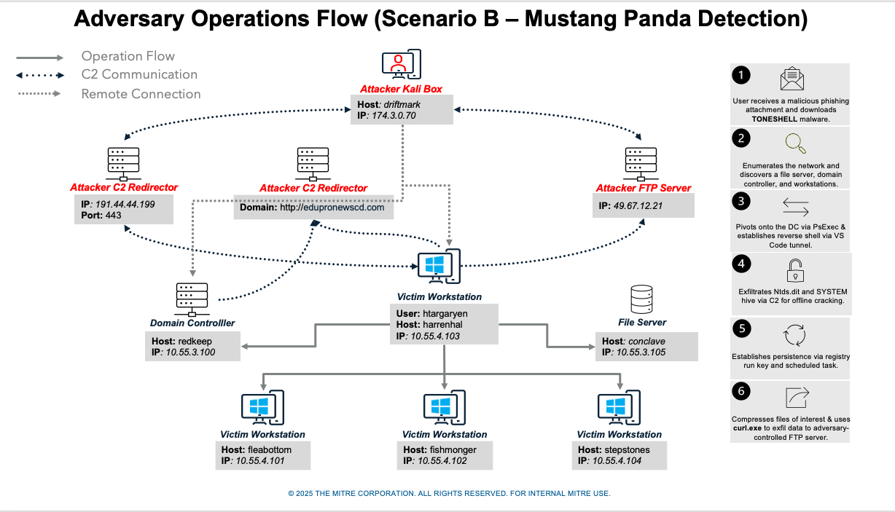
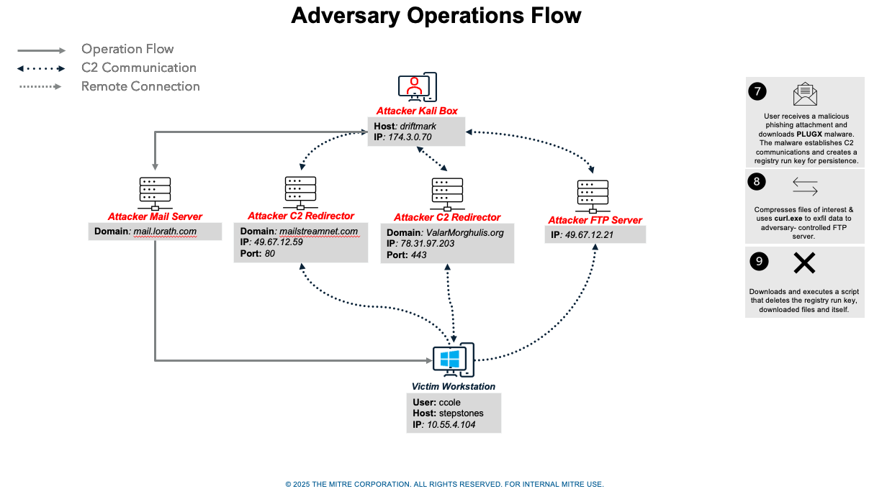

## Overview

Step 1 - Initial Access

In this step, Mustang Panda sends an email containing a malicious .docx file to htargaryen, who opens it, clicks an embedded link, and downloads a password-protected RAR file that ultimately executes a LNK file. The LNK file triggers a chain of actions involving the Toneshell loader (wsdapi.dll), which employs anti-analysis techniques, re-executes itself multiple times, and injects into a waitfor.exe process. Once fully executed, Toneshell EUS decrypts and loads shellcode, gathers victim information, and establishes a connection to the attacker’s command-and-control server over port 443.
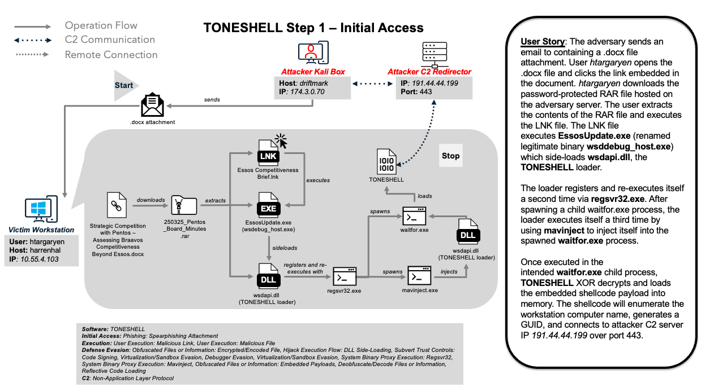

Step 2 - Discovery

Mustang Panda uses Toneshell to perform network discovery on the workstation harrenhal (10.55.4.103). Hermes uses netstat and SharpNBTScan to discover the file server conclave (10.55.3.105) and domain controller redkeep (10.55.3.100).
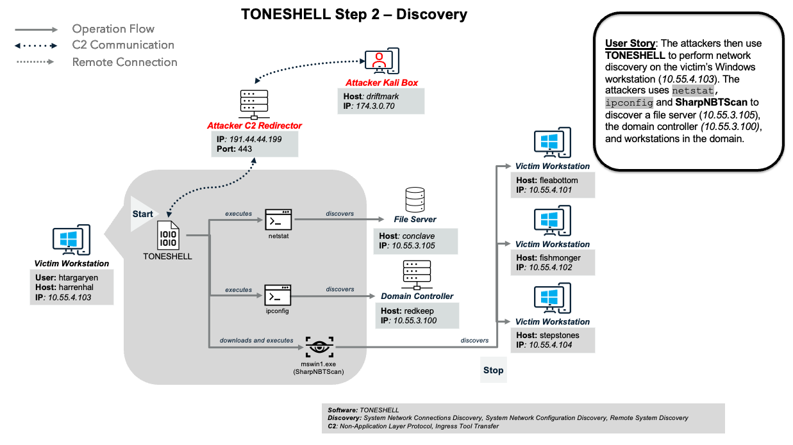

Step 3 - Lateral Movement

After discovering the domain controller redkeep (10.55.3.100), Mustang Panda uses Toneshell to perform lateral movement via PsExec to pivot to the domain controller in preparation for credential dumping. Toneshell uses PsExec to execute the VS Code tunnel batch script on the domain controller to establish a remote shell.
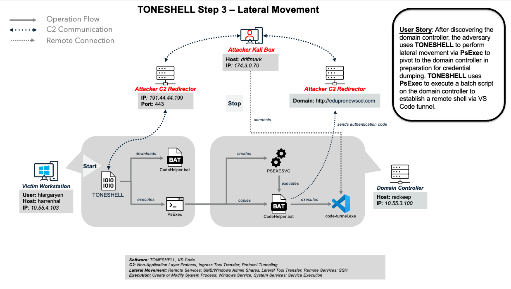

Step 4 - Credential Access

Using the VS Code tunnel on the domain controller redkeep (10.55.3.100), Mustang Panda uses vssadmin and reg save to perform credential dumping via NTDS. Mustang Panda uses the VS Code tunnel on the domain controller to stage the necessary NTDS.dit and SYSTEM hive files back on the initially compromised workstation harrenhal (10.55.4.103). Then, Hermes uses Toneshell to exfiltrate the NTDS files over its existing C2 for offline cracking.
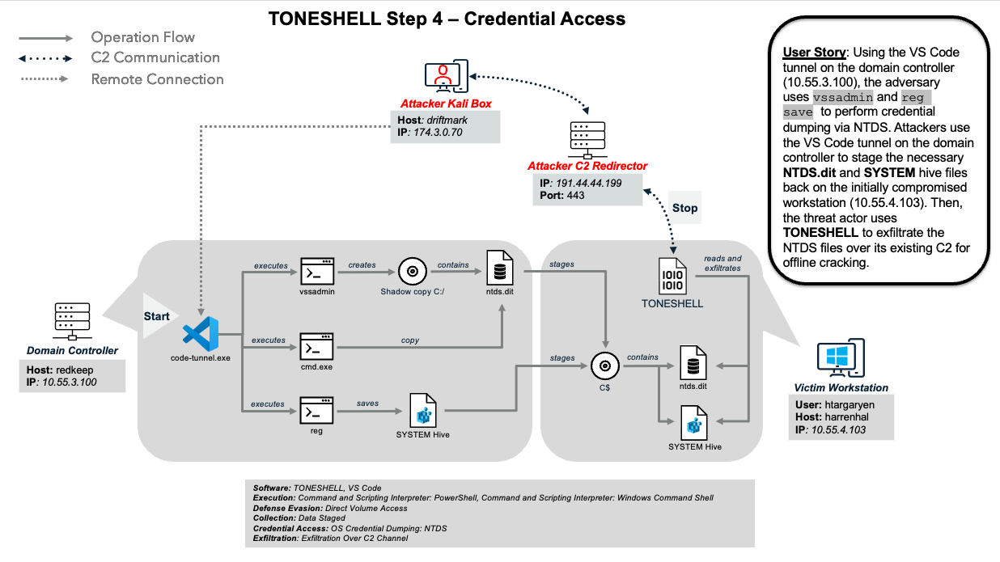

Step 5 - Persistence

Mustang Panda disconnects from the domain controller and installs persistence on harrenhal (10.55.4.103) via registry run key AccessoryInputServices to re-execute Toneshell on user login. Mustang Panda then installs additional persistence by creating a scheduled task to execute the VS Code tunnel batch script. Mustang Panda then executes the persistence mechanism to establish the VS Code tunnel.
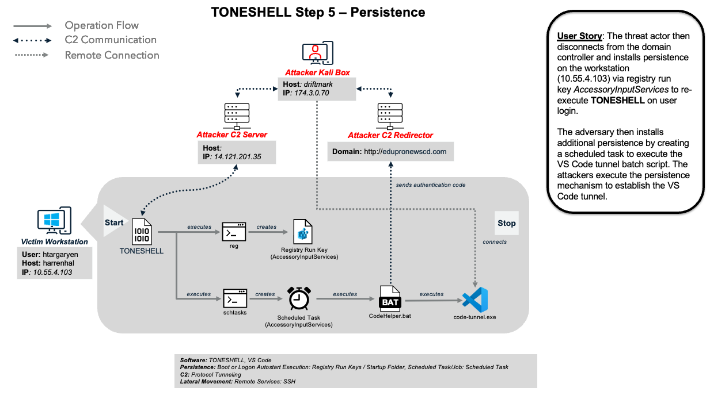

Step 6 - Collection and Exfiltration

Mustang Panda then begins collecting and exfiltrating files of interest. By using a file list with file extensions and folders of interest, Mustang Panda uses the VS Code tunnel to execute WinRAR against several drives of the previously discovered file server conclave (10.55.3.105) to remotely compress files into 250 MB volumes. Then, Mustang Panda uses Toneshell to download and execute a renamed curl.exe and exfiltrate the created RAR archives to an adversary controlled FTP server hosted at 14.121.201.40
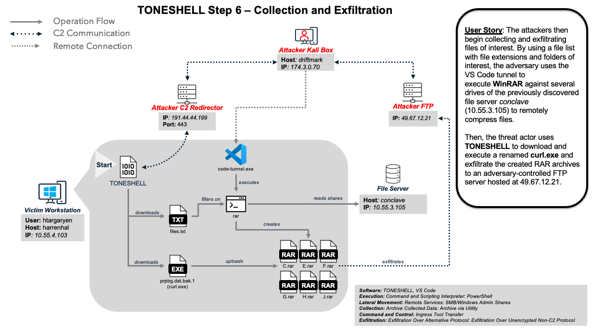

Step 7 - Initial Access

Mustang Panda initiates an attack by sending a spearphishing email to ccole, who downloads a malicious HTML file containing JavaScript that executes and installs a malicious MSI file, 2025p2.msi, on their workstation. The MSI file drops several components, including a legitimate executable (gup.exe), a loader (libcurl.dll), shellcode (WinGUpdate.dat), and a decoy PDF, then uses DLL sideloading to execute the loader and display the decoy file. The PlugX loader decrypts and executes the shellcode, establishing an HTTPS-based command-and-control (C2) channel to 14.121.201.36:443.
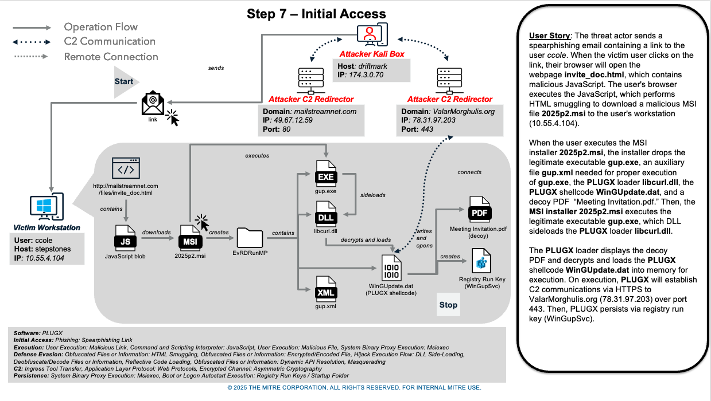

Step 8 - Collection and Exfiltration

After establishing C2 with PlugX, Mustang Panda uses the RAR utility to locate and archive Microsoft Office, PDF, and text files. Mustang Panda then leverages curl to exfiltrate the RAR archive file.
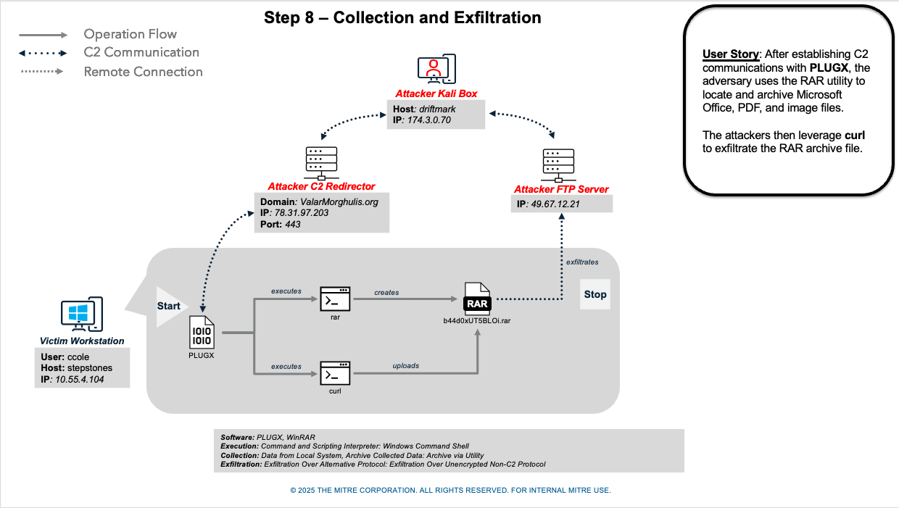

Step 9 - Indicator Removal

After exfiltrating files, Mustang Panda downloads batch script del_WinGupSvc.bat from the C2 server then executes it. On execution, the batch script del_WinGupSvc.bat deletes the registry run key, downloaded files, then itself.
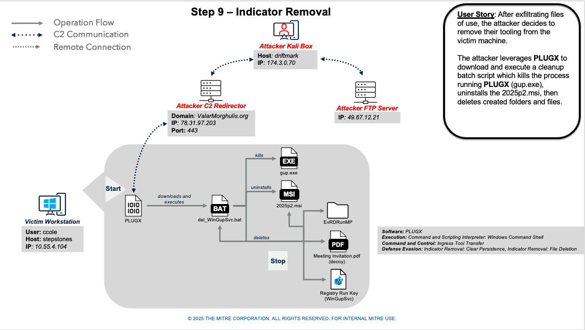
