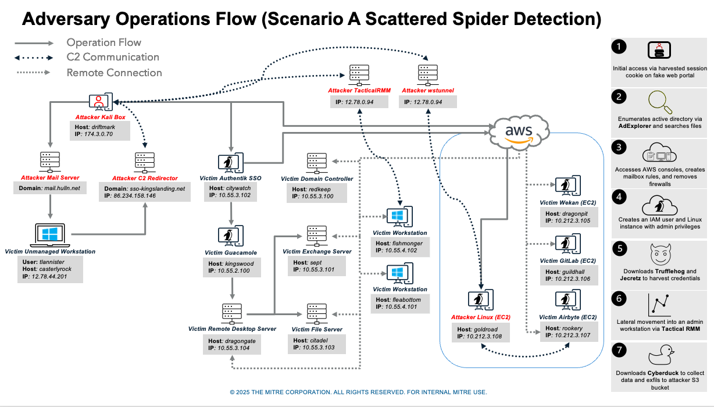
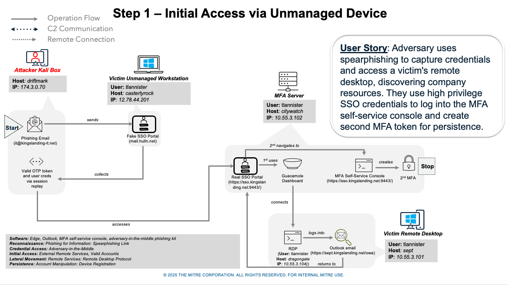
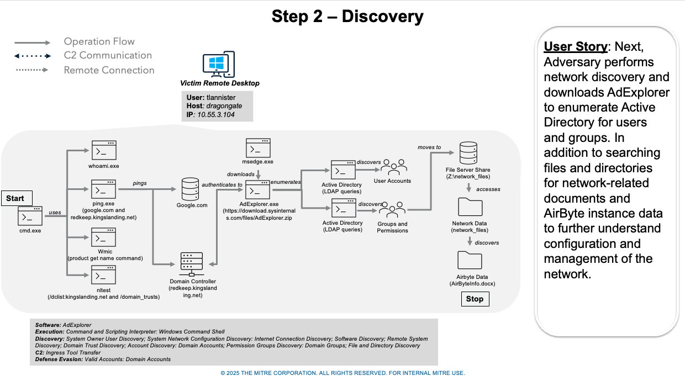
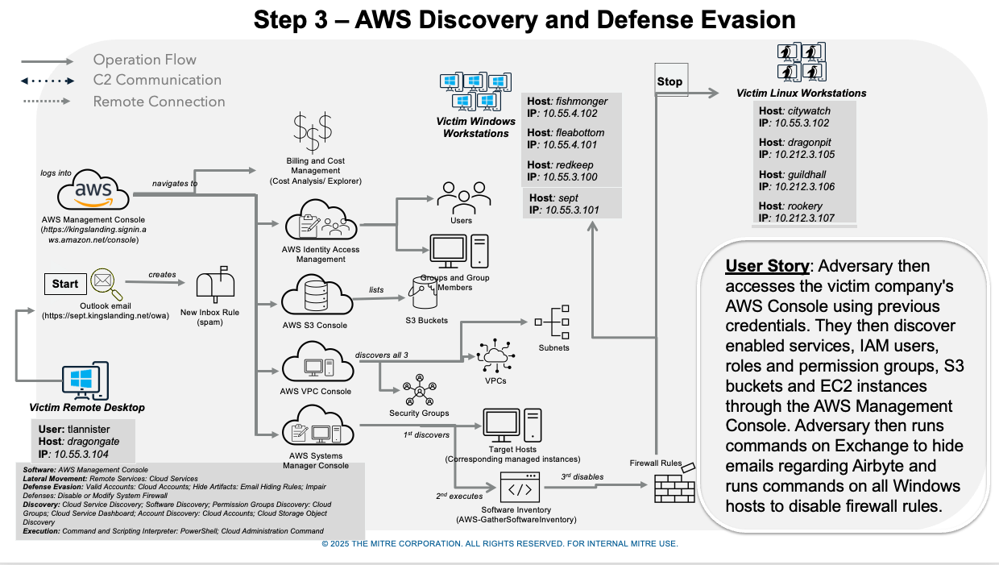
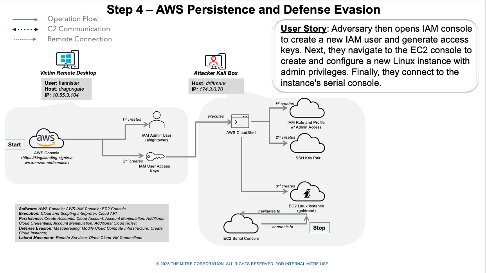
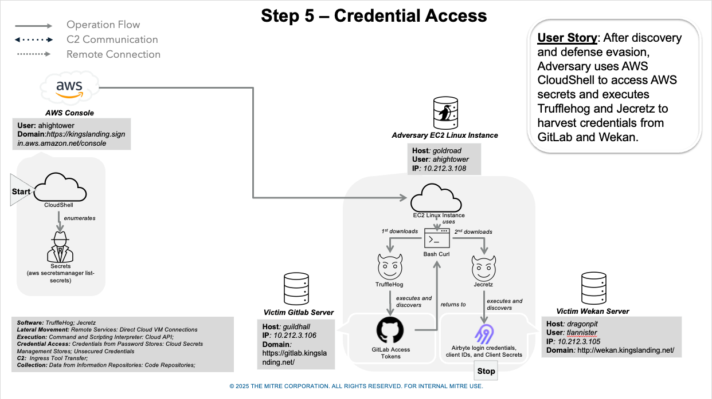
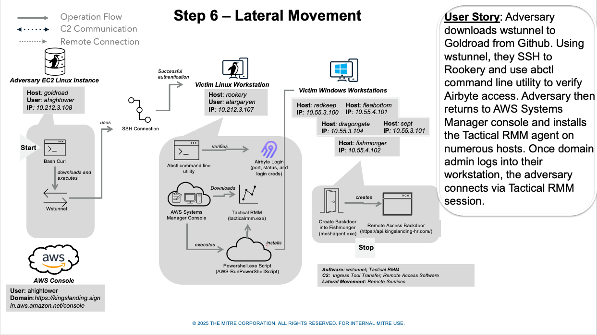
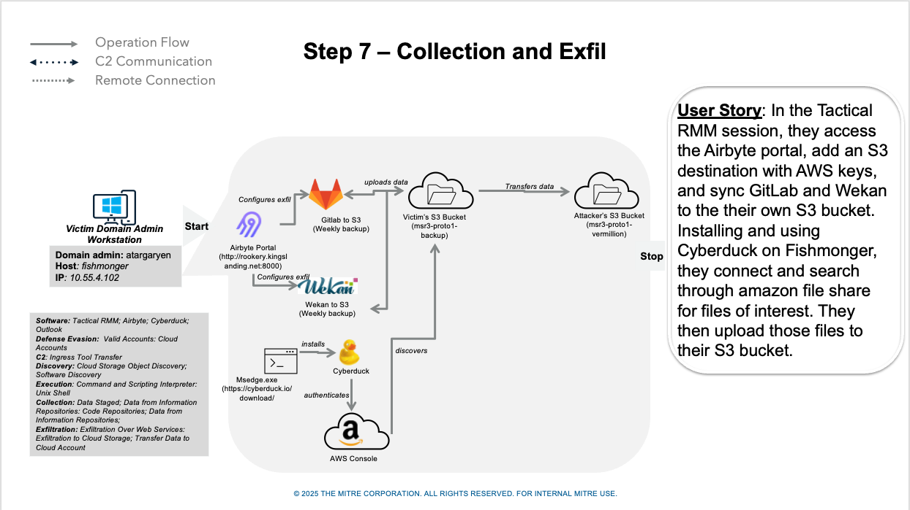

# Scenario Overview

Through spearphishing a victim, Scattered Spider captures credentials via a fake Single Sign On Portal (SSO) portal to obtain a valid session cookie, which is then used to authenticate to the real SSO portal. Here the adversary discovers company resources and uses the SSO dashboard to add a secondary MFA method. While performing network discovery, Scattered Spider identifies connection details for AirByte then to evade detection, it uses the victim’s email account to create inbox rules that hide future AirByte-related emails.

After gaining access to the AWS Console, the adversary discovers various cloud resources available, then runs a command on all Windows hosts to disable firewall rules. Next, Scattered Spider creates a new IAM user and uses this account to generates an interactive session using aws_consoler where an EC2 Linux instance is created. Afterwards, Scattered Spider uses AWS CloudShell to access AWS secrets, execute Trufflehog and Jecretz to harvest credentials. Then downloads wstunnel from Github, using it to tunnel SSH traffic from an adversary controlled server.

Returning to the AWS Systems Manager console, Scattered Spider installs the Tactical RMM then creates a session for lateral movement. Within this session, Scatted Spider accesses the Airbyte portal, adds an S3 destination, and syncs GitLab and Wekan to an adversary-controlled  S3 bucket. Lastly, Cyberduck is installed, used to connect and search through amazon file share for files of interest. These files are exfiltrated to the adversary-controlled  S3 bucket.

## Overview

Step 1 - Initial Access via Unmanaged Device

Scattered Spider uses spearphishing to capture credentials via a fake Single Sign On Portal (SSO) and access a victim's remote desktop, discovering company resources (i.e. company AWS account, Guacamole, internal GitLab and AirByte). The threat actor use high privilege SSO credentials to log into the MFA self-service console and create second MFA token for persistence.

Step 2 - Discovery

Next, Scattered Spider performs network discovery, downloads AdExplorer to enumerate Active Directory, searches files and directories for network-related documents. The advesary discovers information  on how to connect to the company’s AirByte instance.

Step 3 - AWS Discovery and Defense Evasion

Scattered Spider then uses the victim’s email account to set up new inbox rules to hide future emails regarding Airbyte. Through social engineering, the threat actor obtains a Multi-Factor Authentication (MFA) token giving access to the company's AWS Console. Through the AWS Management Console, Scattered Spider discovers enabled services, Identity and Access Management (IAM) users, roles and permission groups, S3 buckets and EC2 instances . Scattered Spider then runs commands on all Windows hosts to disable firewall rules.

Step 4 - AWS Persistence and Defense Evasion

Scattered Spider creates a new IAM user and uses this account to generates an interactive session using aws_consoler. In this session, Scattered Spider creates an EC2 Linux instance which acts as a staging point for payloads, a pivot point and backdoor for persistence.

Step 5 - Credential Access

Scattered Spider uses AWS CloudShell to access AWS secrets and executes Trufflehog and Jecretz to harvest credentials from GitLab and Wekan.

Step 6 - Lateral Movement

Scattered Spider downloads wstunnel from Github then uses wstunnel to tunnel SSH traffic from an adversary controlled server through the created EC2 Linux instance rookery (10.212.3.107) hosting AirByte. The tunnel is used to initiate an SSH connection to rookery (10.212.3.107), executes commands to confirm login credentials for AirByte. Scattered Spider then returns to AWS Systems Manager console to install the Tactical RMM agent on numerous hosts. A Tactical RMM session is created to connect to fishmonger (10.55.4.102) for lateral movement.

Step 7 - Collection and Exfil

In the Tactical RMM session connected to fishmonger (10.55.4.102), Scatted Spider access the Airbyte portal, adds an S3 destination with AWS keys, and sync GitLab and Wekan to an adversary-controlled  S3 bucket. Next, Cyberduck is installed then used on fishmonger (10.55.4.102), to connect and search through amazon file share for files of interest. These files are exfiltrated to the adversary-controlled  S3 bucket.

