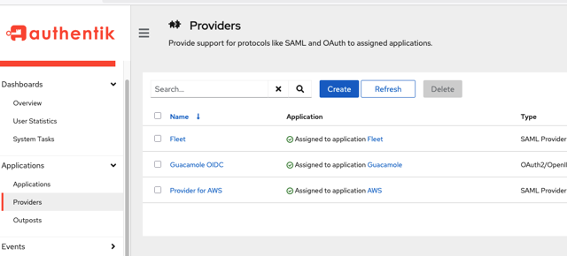
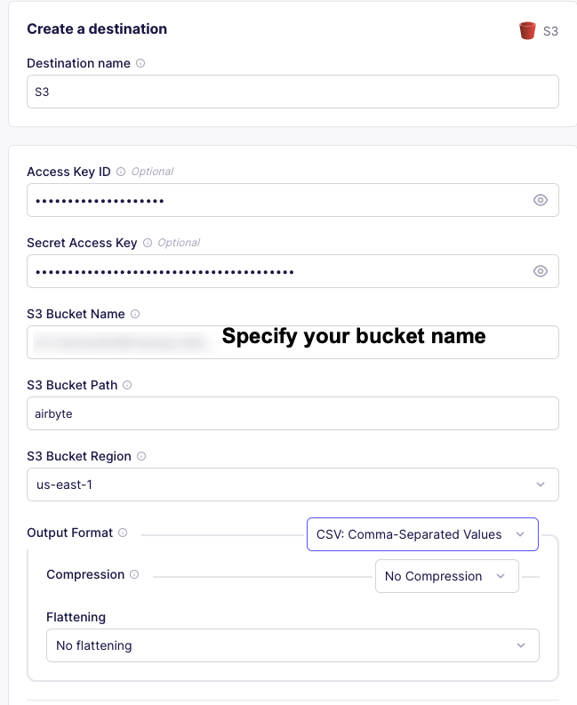
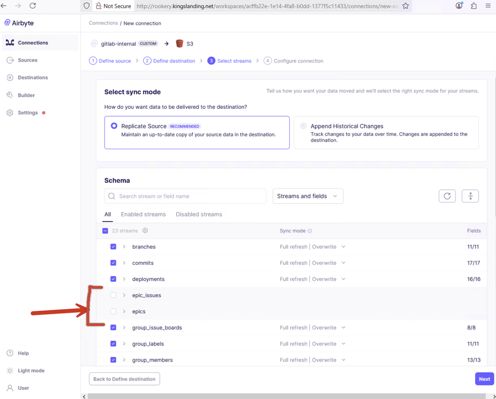

# Post-Deployment

After configuring the Enterprise 2025 infrastructure, the following manual steps are required.

<!-- TOC -->
* [Post-Deployment](#post-deployment)
  * [Authentik Setup](#authentik-setup)
    * [Procedure](#procedure)
  * [Airbyte Setup](#airbyte-setup)
    * [Procedure](#procedure-1)
      * [Setup Connectors](#setup-connectors)
      * [Setup Connections](#setup-connections)
        * [Gitlab-to-S3 Connection](#gitlab-to-s3-connection)
        * [Wekan-to-S3 Connection](#wekan-to-s3-connection)
<!-- TOC -->

## Authentik Setup

Authentik requires manual actions to complete setup. The procedure in this section must be done twice, once each for:

1. Detections on `kingslanding.net`
2. Protections on `vale.net`

### Procedure

Please use the following admin credentials for the Authentik SSO service:

| Authentik SSO URL            | Username | Password                       |
|------------------------------|----------|--------------------------------|
| <https://sso.kingslanding.net> | akadmin  | `Broker-Eagle-Angrily-Candied` |
| <https://sso.vale.net>         | akadmin  | `Broker-Eagle-Angrily-Candied` |

1. Open a web browser to the Authentik SSO URL, logon with the `akadmin` admin credentials, then select the *Admin interface* (top right corner).
2. Navigate to *Applications > Providers*

    !!!
    If *Provider for AWS* is missing, please either rerun the `update-authentik-postdeploy.yml`
    or the `deploy2` Make target that contains this playbook.
    !!!

3. Click into *Provider for AWS*
4. Under Metadata, select *Download*
5. Logon to the AWS account of the domain being configured (Detections for Kingslanding, Protections for Vale)
6. Navigate to *IAM > Access Management > Identity Providers*
7. Select *Add Provider*
8. Name this provider `authentik`
   1. If this is named anything other than `authentik`, this configuration will not work.
9. Under *Metadata document*, select *Choose File*
10. Upload the Metadata file downloaded from the Authentik SSO dashboard (Step 4), then select *Add provider*.

## Airbyte Setup

The S3 destination is a per-range configuration that must be added post-deployment.

| Airbyte URL                     | Username                    | Password                           |
|---------------------------------|-----------------------------|------------------------------------|
| <http://rookery.kingslanding.net> | <tlannister@kingslanding.net> | `5325OLZ9vcruy8H55qqhhmxK9xH7ooGb` |

Note that this section refers to the Detections account associated with the `kingslanding` domain.

### Procedure

#### Setup Connectors

1. Open a web browser, navigate to the Airbyte URL, and logon with the local admin credentials above.
2. On the left menu, select *Destinations*
3. Choose *S3*
4. Open a new tab to logon to the Detections AWS account
5. Navigate to *IAM > Access Management > Users*
6. Select the `backup-bot` user.

    

    !!!
    The `backup-bot` user and the correct permissions are created with Terraform. If they do not exist, check the Terraform state for this range. Do not manually change, delete, or create the `backup-bot` user or permissions.
    !!!

7. Click *Create access key*
8. Select *Other* from the list of use cases and hit *Next*
9. Type `airbyte` into the Description tag value and select *Create access key*
10. Copy the Access Key ID, return to the Airbyte tab, and paste this in the *Access Key ID* field.
11. Copy the Secret Access Key, return to the Airbyte tab, and paste this in the *Secret Access Key* field.
12. Please validate and set the remaining fields using the table below:

    | Airbyte Setting   | Value                              | Notes                                                                                                                                      |
    |-------------------|------------------------------------|--------------------------------------------------------------------------------------------------------------------------------------------|
    | Access Key ID     | `backup-bot` Access Key ID         | Access Key ID generated in steps 7-9.                                                                                                      |
    | Secret Access Key | `backup-bot` Secret Access Key     | Secret Access Key generated in steps 7-9.                                                                                                  |
    | S3 Bucket Name    | `er7-enterpriseround7-backup-data` | This bucket was created by Terraform and matches the access policies. Do not create a new bucket. Validate by viewing existing S3 buckets. |
    | S3 Bucket Path    | `airbyte`                          | Name must match exactly.                                                                                                                   |
    | S3 Bucket Region  | `us-east-1`                        | Default region.                                                                                                                            |

13. Select *Set up destination*. If tests do not pass, validate the bucket name and keys.

#### Create Custom Sources

Setup custom source connectors for Airbyte to use for connections to GitLab and Wekan.

##### Wekan Source

By default, Wekan only supports using MongoDB deployments in a clustered, replica set configuration. Wekan requires a specific version of the MongoDB source connector to pull data from a non-clustered database (single instance, no replica set).

1. Open a web browser, navigate to the Airbyte URL, and logon with the local admin credentials above.
2. Settings → Sources.
3. Select `New Connector` → `Add a new Docker connector`.
4. Set the new connector fields using the table below:

    | Setting   | Value                              | Notes                                                                                                                                      |
    |-------------------|------------------------------------|--------------------------------------------------------------------------------------------------------------------------------------------|
    | Connector display name       | `mongo-legacy`                | Name of new source connector  |
    | Docker repository name       | `airbyte/source-mongodb`      | Image                         |
    | Docker image tag             | `0.3.3`                       | This version allows connections to non-clustered databases |
    | Connector documentation URL  | < leave blank >               | Blank                         |

5. Select `Add`.
6. Set the new source fields using the table below:

    | Setting   | Value                              | Notes                                                                                                                                      |
    |-------------------|------------------------------------|--------------------------------------------------------------------------------------------------------------------------------------------|
    | Host                         | `wekan.kingslanding.net`        | Wekan hostname        |
    | Port                         | `27017`                         | Default               |
    | Database name                | `wekan`                         | Database to replicate |
    | User                         | `airbytebackup`                 |                       |
    | Password                     | `Snowfall-Stoplight`            |                       |
    | Authentication source        | `wekan`                         |                       |

7. Select `Test the source` and validate the connection tests are successful.

Note: These values are set in the vars in wekan.yml If validation fails, check the values and retry.

##### Gitlab Source Container

The Gitlab source connector container does not support custom certificates. To use a custom certificate (such as self-signed), the Gitlab source connector container must be modified to include and trust the certificate authority used on the evaluation range.

1. SSH to the Airbyte host. Open two separate terminal windows.
2. In one terminal, launch a copy of the official Airbyte gitlab-source container `docker run --name testgitlab --rm --entrypoint="" -it -u root airbyte/source-gitlab /bin/bash`
3. In a second terminal, load the range root certificate into the container. `docker cp /usr/local/share/ca-certificates/COUNCILCA.crt $(docker ps --filter "name=testgitlab" --format "{{.ID}}"):/usr/local/share/ca-certificates/`
4. In the container (first terminal), run `update-ca-certificates`
5. In the container (first terminal), add the cert to the python certifi store `cat /usr/local/share/ca-certificates/COUNCILCA.crt >> /usr/local/lib/python3.11/site-packages/certifi/cacert.pem`
6. On the host (second terminal), save updated image `docker commit $(docker ps --filter "name=testgitlab" --format "{{.ID}}") rookery.kingslanding.net/source-gitlab:1`
7. On the host (second terminal), push the updated image to the internal registry. `docker push rookery.kingslanding.net/source-gitlab:1`

##### Gitlab Source Connector

To build a custom source from the updated gitlab container:

1. Open a web browser, navigate to the Airbyte URL, and logon with the local admin credentials above.
2. Settings → Sources.
3. Select `New Connector` → `Add a new Docker connector`.
4. Set the new connector fields using the table below:

    | Setting   | Value                              | Notes                                                                                                                                      |
    |-------------------|------------------------------------|--------------------------------------------------------------------------------------------------------------------------------------------|
    | Connector display name       | `gitlab-internal`                             | Name of new source connector  |
    | Docker repository name       | `rookery.kingslanding.net/source-gitlab`      | Image                         |
    | Docker image tag             | `1`                       | Match this to the tag on created gitlab source container |
    | Connector documentation URL  | < leave blank >               | Blank

5. Select `Add`.
6. Set the new source fields using the table below:

    | Setting   | Value                              | Notes                                                                                                                                      |
    |-------------------|------------------------------------|--------------------------------------------------------------------------------------------------------------------------------------------|
    | Authentication Method        | `Private Token`                        | This is a drop-down selection that will expose the private token field       |
    | Private Token                | `<glpat token from gitlab>`            |                           |
    | API URL                      | `gitlab.kingslanding.net`              | Under Optional Fields     |
    | Groups                       | `systems`                              | Under Optional Fields     |

7. Select `Test the source` and validate the connection tests are successful.

#### Setup Connections

Setup sync tasks for GitLab and Wekan → S3 using Airbyte.

##### Gitlab-to-S3 Connection

1. Connections → New Connection.
2. Select `gitlab-internal` source.
3. Select S3 destination.
4. Wait for schema fetch.
5. Select all **except for Epics.**
   1. Deselect `epics`
   2. Deselect `epic_issues`

    
6. Click Next.
7. Click “Finish and Sync”. Defaults are fine.

##### Wekan-to-S3 Connection

1. Connections → New Connection.
2. Select `mongo-legacy` source.
3. Select S3 destination.
4. Wait for schema fetch.
5. Select all.
6. Click Next.
7. Click “Finish and Sync”. Defaults are fine.
