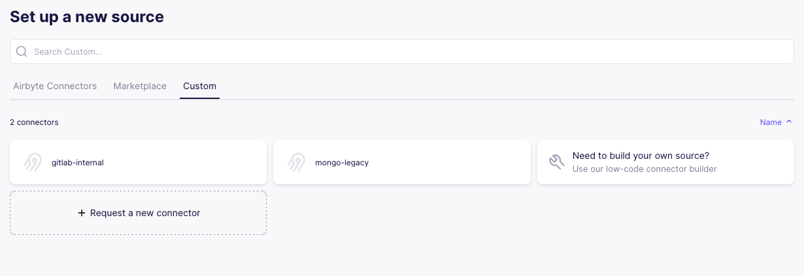
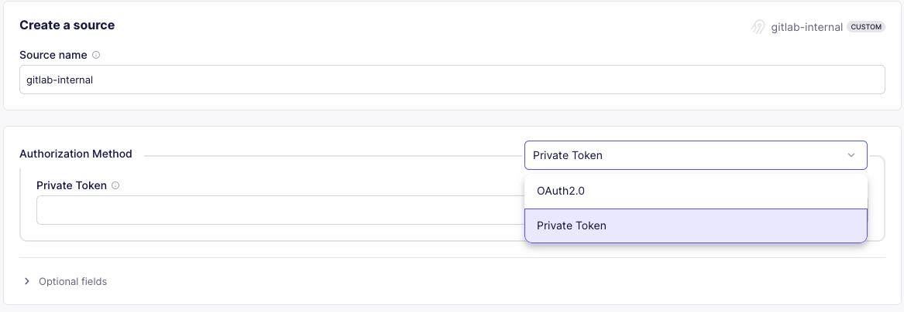
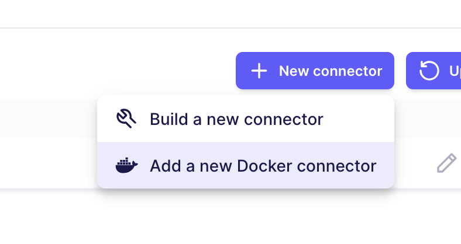
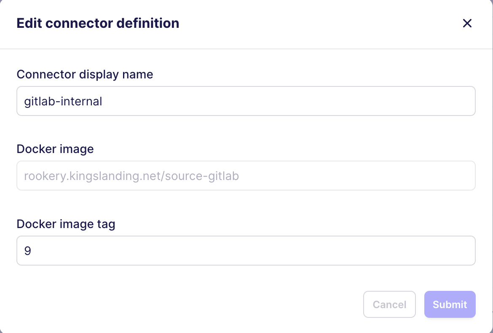

# Pre-Deployment

The following steps should be performed after [deploying the infrastructure](../terraform/README.md).

<!-- TOC -->
* [Pre-Deployment](#pre-deployment)
  * [Airbyte](#airbyte)
    * [Mongo Source Connector](#mongo-source-connector)
    * [GitLab Source Connector](#gitlab-source-connector)
  * [Build Custom Connectors](#build-custom-connectors)
<!-- TOC -->

## Airbyte

| Airbyte URL                     | Username                    | Password                           |
|---------------------------------|-----------------------------|------------------------------------|
| <http://rookery.kingslanding.net> | <tlannister@kingslanding.net> | `5325OLZ9vcruy8H55qqhhmxK9xH7ooGb` |

Note that this section refers to the Detections account associated with the `kingslanding` domain.

### Mongo Source Connector

1. Log into Airbyte (rookery.kingslanding.net)

2. In the left column, select *Sources*.

    !!!
    If there are already sources, you may need to select the *New Source* button. If there is already a `mongo-legacy` source, then skip to [the next section](#gitlab-source-connector).
    !!!

3. Under *Set up a new source*, select the *Custom* tab.

!!!
If the custom connectors have been set up, you should see `gitlab-internal` and `mongo-legacy` as options. If they are not available, go to [*Build Custom Connectors*](#build-custom-connectors) before performing these steps.
!!!



### GitLab Source Connector

1. Log into Airbyte (rookery.kingslanding.net)

2. In the left column, select *Sources*. If there are already sources, select the *New Source* button.

3. Under *Set up a new source*, select the *Custom* tab.

    !!!
    If `gitlab-internal` and `mongo-legacy` are not available, go to [*Build Custom Connectors*](#build-custom-connectors) before performing these steps.
    !!!

4. Select `gitlab-internal`
5. Under *Authorization Method*, click the drop-down menu that defaults to OAuth2.0, and select *Private Token*
6. Set the *Private Token* field to the glpat token.

    

7. Expand the Optional Fields in light gray at the bottom and ensure these are properly set:

    > Start Date: *\<leave blank\>*
    >
    > API URL: `gitlab.kingslanding.net`
    >
    > Groups: `systems`
    >
    > Projects: *\<leave blank\>*

8. Select Test the source and validate the connection tests are successful.

9. Select the S3 destination. If that has not already been configured, see the Set Up S3 Destination section

## Build Custom Connectors

### Stage GitLab connector (docker)

1. Create certificates for rookery, move cert and key to `/opt/registry/certs`

2. Launch docker registry using that certificate and key

    ```bash
    mkdir /opt/registry/certs
    sudo mv rookery.crt /opt/registry/certs/
    sudo mv rookery.key /opt/registry/certs/
    mcd /opt/registry/
    docker run -d \
        --restart=always \
        --name registry \
        -v "$(pwd)"/certs:/certs \
        -e REGISTRY_HTTP_ADDR=0.0.0.0:443 \
        -e REGISTRY_HTTP_TLS_CERTIFICATE=/certs/rookery.crt \
        -e REGISTRY_HTTP_TLS_KEY=/certs/rookery.key \
        -p 443:443 \
        registry:latest
    ```

3. Load root certs into airbyte host. There is a playbook for this, but can be done manually using the following commands.
4. Then restart docker service so it uses new cert store.

    ```bash
    cp <root cert> /user/local/share/ca-certificates/
    update-ca-certificates
    sudo systemctl restart docker
    ```

5. Load and push docker image

    ```bash
    docker image load -i source-gitlab.9.tgz
    docker image push rookery.kingslanding.net/source-gitlab:9
    ```

6. Add root cert to `abctl` docker container

    ```bash
    docker exec -it airbyte-abctl-control-plane /bin/bash
    echo <root cert> > /user/local/share/ca-certificates/root-ca
    update-ca-certificates
    ```

### Add the connector (docker)

1. Log in to Airbyte
2. Select *Settings > Sources*
3. Select *+ New connector* and *Add a new Docker connector*

    

4. Name the new connector `gitlab-internal`
5. Specify Docker image: `rookery.kingslanding.net/source-gitlab`
6. Specify tag to match image pushed — current version is 9


