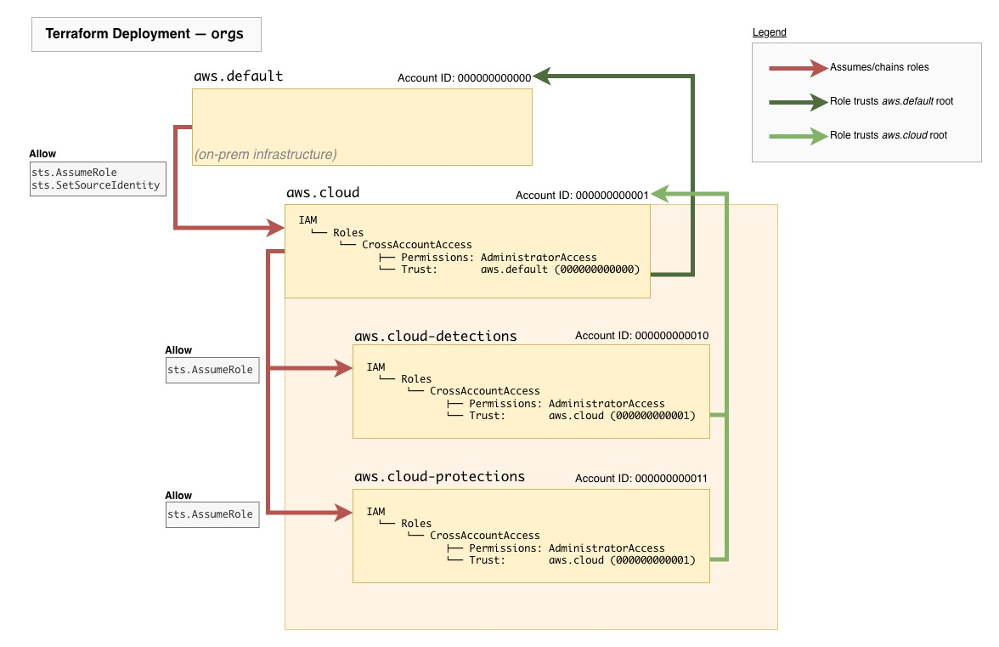

# Infrastructure as Code (Terraform)

Enterprise 2025 infrastructure deployment is a multi-step process involving three Terraform backends:

1. [AWS Account Setup: `orgs`](./orgs/README.md) — creation/setup of Detections & Protections AWS accounts; establishes cross-account access through an assumable role (IAM) in each.
2. [Attacker Staging: `s3`](./s3/README.md) — Scenario-relevant data and adversary staging in customer environment.
3. [Evaluation Environment: `range`](./range/README.md) — EC2 instances and networking between on-prem, cloud, and any partner infrastructure.  <br>

Each stage creates and maintains infrastructure using local state files. Each stage's directory should contain a `terraform.tfstate` file when deployed.

<!--
`modules` are common components (e.g., `base-vm`, `vpn-client`) or optional features (e.g., `traffic-mirror`), which are referenced by the three Terraform configurations above.
-->

> ☀️ After deployment, please see the [Configuration Overview](../ansible/README.md) to configure the infrastructure.

## Terraform Providers

The Terraform/AWS providers distinguish where each resource is deployed and are defined in each stage's `provider.tf`.

1. `aws.default` — this resource is deployed to the default account (on-prem). If none is defined in a resource, assume it is deployed to this account.
2. `aws.cloud` — this resource is deployed to the cloud management account.
   1. `aws.cloud-detections`  — this resource is deployed to the cloud detections account.
   2. `aws.cloud-protections` — this resource is deployed to the cloud protections account.

## Deployment Order

Please review the documentation for each of the three deployments before proceeding with the full deployment.
Please note that the `s3` and `range` deployments reference account information from the [outputs](https://developer.hashicorp.com/terraform/language/block/output) in `orgs`.

```bash
## (1) Deploy orgs -- create the detections & protections accounts (aws.cloud)
cd orgs/
terraform init
terraform validate
terraform plan --out=tfplan
terraform apply tfplan

## (2) Deploy s3 -- customer data, files, adversary staging (aws.default, aws.cloud-detections, aws.cloud-protections)
cd ../s3/
terraform init
terraform validate
terraform plan --out=tfplan
terraform apply tfplan

## (3) Deploy range -- ec2, networking, cross-account transit gateway, and other (aws.default, aws.cloud-detections, aws.cloud-protections)
cd ../range/
terraform init
terraform validate
terraform plan --out=tfplan
terraform apply tfplan
```

## Cross-Account Management

Role-chaining is essential for staging and deploying resources amongst multiple account providers.
Each provider is configured with the `CrossAccountAccess` role for cross-account administration, with trust relationships shown below:



## Notice

© 2025 MITRE. Approved for public release. Document number 25-2969.

Licensed under the Apache License, Version 2.0 (the "License"); you may not use this
file except in compliance with the License. You may obtain a copy of the License at

<http://www.apache.org/licenses/LICENSE-2.0>

Unless required by applicable law or agreed to in writing, software distributed under
the License is distributed on an "AS IS" BASIS, WITHOUT WARRANTIES OR CONDITIONS OF ANY
KIND, either express or implied. See the License for the specific language governing
permissions and limitations under the License.
